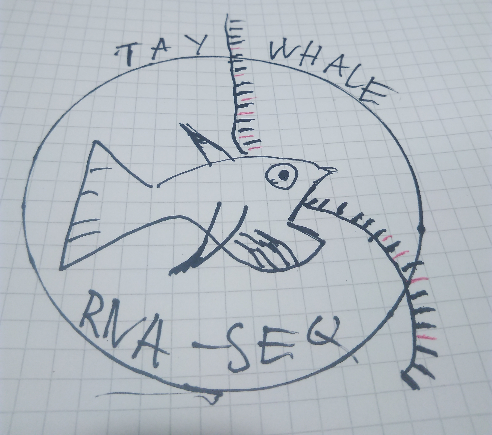

# TayWhale - a RNA seq pipeline
The TayWhale pipeline performs alignment using STAR, transript quantification using Salmon, Fusion transcript detection using STAR-Fusion, transcript assembly using Sringie, and allele specific expression using GATK.

The pipeline is still being developed!

# Command line
Activate the conda environment

        source activate TayWhale

Next, you may run the pipeline

    nextflow TayWhale.nf --r1 read1.fq --r2 --read2.fq --sample sampleID --output output_directory -c config

# Install
Install the dependencies:

    STAR
    
    STAR-Fusion

    Samtools

    Picard tools

	sringtie
	
	gffcompare

	salmon

	GATK

	python 2.7

Create indexes for salmon, star fusion, and star, remember to generate genome dictionary and fasta index files!

run the install script to generate a config file:

python install.py

Lastly, enter the config file and set the path variables:

        nano TayWhale.conf

